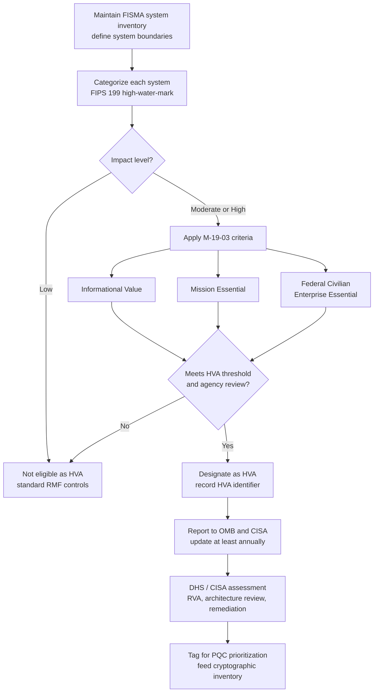
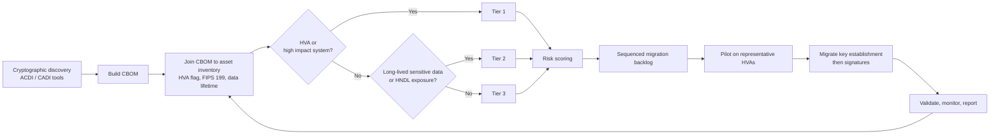
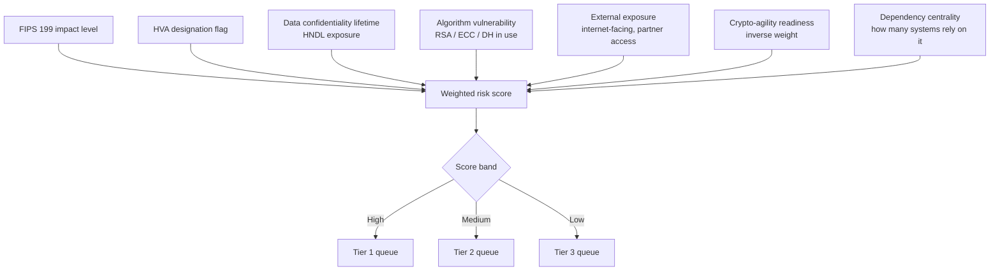
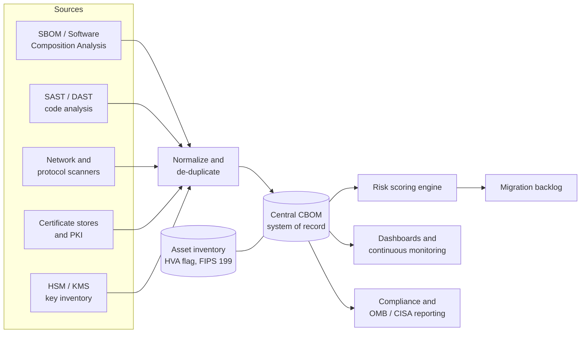
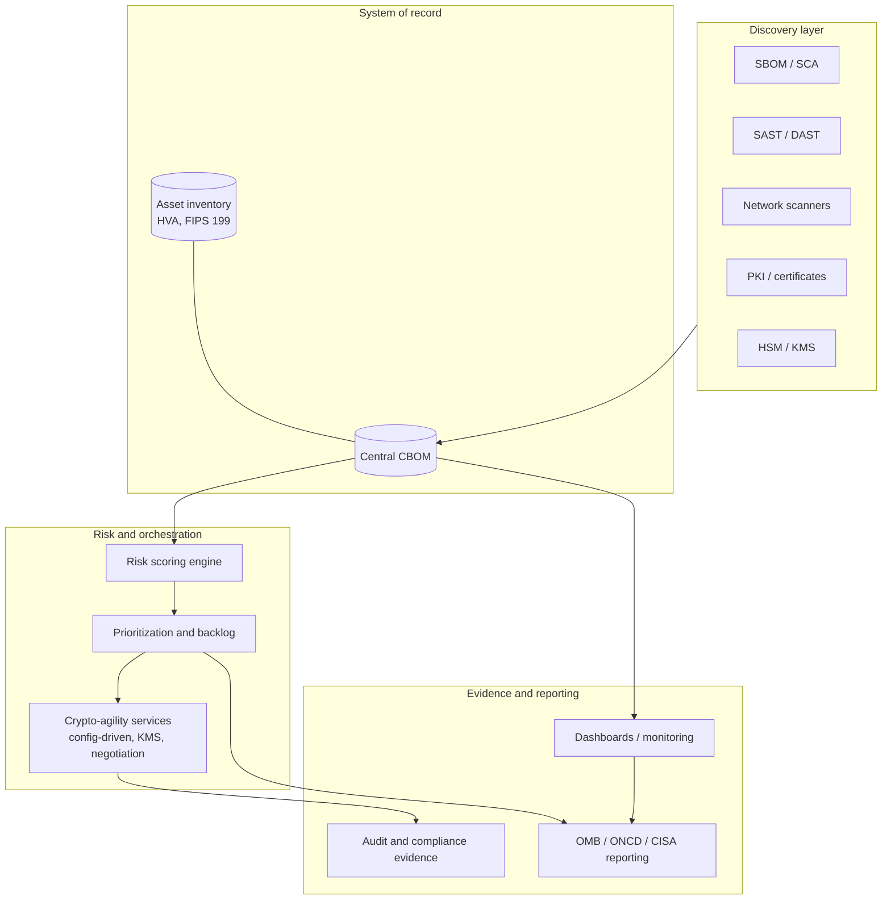
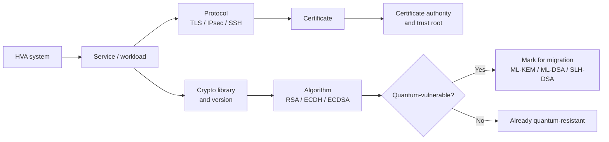

# US OMB High Value Assets (HVA) Requirements for Post-Quantum Cryptography Migration

> A reference guide for CISOs, enterprise architects, government agencies, security engineers, compliance teams, software vendors, and post-quantum cryptography (PQC) migration teams.

**Repository:** `owlmt/PQC_Requirements`
**Status:** Living document
**Last reviewed:** 28 June 2026
**Scope:** US Federal Civilian Executive Branch (FCEB) policy on High Value Assets and its role in prioritizing PQC migration. National Security Systems (NSS) are governed by separate authorities (CNSS, NSA, DoW) and are noted where relevant.

> **Disclaimer.** This document is an informational synthesis of public US Government policy. It is not legal advice and is not an official government publication. Always consult the primary sources linked throughout and in the appendices. Where a policy may have been superseded, amended, or relocated after an administration transition, the appendices flag the most stable official `.gov` location available at the time of review.

---

## Table of Contents

- [1. What Is a High Value Asset (HVA)?](#1-what-is-a-high-value-asset-hva)
- [2. Official US OMB Definition](#2-official-us-omb-definition)
- [3. History of the HVA Program](#3-history-of-the-hva-program)
- [4. OMB Memorandum Timeline](#4-omb-memorandum-timeline)
- [5. OMB Memorandum M-17-09](#5-omb-memorandum-m-17-09)
- [6. OMB Memorandum M-19-03](#6-omb-memorandum-m-19-03)
- [7. OMB Memorandum M-22-09 and Zero Trust](#7-omb-memorandum-m-22-09-and-zero-trust)
- [8. OMB Memorandum M-23-02 on Post-Quantum Cryptography Migration](#8-omb-memorandum-m-23-02-on-post-quantum-cryptography-migration)
- [9. OMB Memorandum M-26-15 on Execution of PQC Migration](#9-omb-memorandum-m-26-15-on-execution-of-pqc-migration)
- [10. Relevant NIST Guidance](#10-relevant-nist-guidance)
- [11. Relevant CISA Guidance](#11-relevant-cisa-guidance)
- [12. HVA and the Federal Risk Management Framework](#12-hva-and-the-federal-risk-management-framework)
  - [HVA and FIPS 199](#hva-and-fips-199)
  - [HVA and FIPS 200](#hva-and-fips-200)
  - [HVA and NIST SP 800-53](#hva-and-nist-sp-800-53)
  - [HVA and NIST SP 800-208](#hva-and-nist-sp-800-208)
  - [HVA and CNSA 2.0](#hva-and-cnsa-20)
  - [HVA and Executive Order 14028](#hva-and-executive-order-14028)
- [13. How Agencies Identify High Value Assets](#13-how-agencies-identify-high-value-assets)
- [14. Examples of High Value Assets](#14-examples-of-high-value-assets)
- [15. Why HVA Identification Is Essential Before PQC Migration](#15-why-hva-identification-is-essential-before-pqc-migration)
- [16. Recommended PQC Migration Prioritization Framework](#16-recommended-pqc-migration-prioritization-framework)
- [17. Suggested Risk Scoring Model](#17-suggested-risk-scoring-model)
- [18. Suggested Implementation Workflow](#18-suggested-implementation-workflow)
- [19. Suggested CBOM Integration](#19-suggested-cbom-integration)
- [20. Suggested CADI and ACDI Integration](#20-suggested-cadi-and-acdi-integration)
- [21. Suggested Enterprise Architecture](#21-suggested-enterprise-architecture)
- [22. Common Mistakes](#22-common-mistakes)
- [23. Best Practices](#23-best-practices)
- [24. Checklist for Organizations](#24-checklist-for-organizations)
- [25. Future Considerations](#25-future-considerations)
- [26. References](#26-references)
- [27. Bibliography](#27-bibliography)
- [Appendix A. Referenced OMB Memoranda](#appendix-a-referenced-omb-memoranda)
- [Appendix B. NIST Publications](#appendix-b-nist-publications)
- [Appendix C. CISA Guidance](#appendix-c-cisa-guidance)
- [Appendix D. Executive Orders and Federal Publications](#appendix-d-executive-orders-and-federal-publications)

---

## 1. What Is a High Value Asset (HVA)?

A High Value Asset (HVA) is a Federal information system, information, or data asset whose compromise would cause a disproportionately large impact on the United States. The HVA concept exists because not all Federal systems are equally important: a small subset carries national security, economic, public-safety, or whole-of-government significance far beyond an individual agency's own operations. HVAs are the systems that adversaries most want, and therefore the systems that the Federal Government protects, assesses, and remediates with the highest priority.

In practice, an HVA is a designation layered on top of normal Federal risk management. A system is first inventoried and categorized under the Federal Information Security Modernization Act (FISMA) process. If it crosses certain impact and value thresholds, it is additionally flagged as an HVA, which subjects it to heightened governance, assessment by the Department of Homeland Security (DHS) and the Cybersecurity and Infrastructure Security Agency (CISA), and accelerated remediation expectations.

For post-quantum cryptography, the HVA designation has become a primary prioritization lever. Because the migration away from quantum-vulnerable public-key cryptography is a multi-year effort that no agency can complete instantly, Federal policy directs agencies to migrate their HVAs and high impact systems first. The HVA inventory is, in effect, the front of the PQC migration queue.

---

## 2. Official US OMB Definition

The Office of Management and Budget (OMB) has defined HVAs in two successive memoranda. Both definitions remain useful: the earlier one frames the consequence of compromise, and the later one broadens the criteria for designation.

**OMB Memorandum M-17-09 (2016)** defined HVAs as those assets, Federal information systems, information, and data for which unauthorized access, use, disclosure, disruption, modification, or destruction could cause a significant impact to United States national security interests, foreign relations, the economy, or to the public confidence, civil liberties, or public health and safety of the American people. See [M-17-09 (PDF)](https://obamawhitehouse.archives.gov/sites/default/files/omb/memoranda/2017/m-17-09.pdf).

**OMB Memorandum M-19-03 (2018)** superseded the M-17-09 definition and moved away from a single rigid definition toward a flexible, criteria-based approach. Under M-19-03 and its supplemental guidance, a Federal information system or information may be designated an HVA if it falls into one or more of three categories:

- **Informational Value:** the information or information system processes, stores, or transmits information that is of high value to the Government or its adversaries.
- **Mission Essential:** the agency depends on the system to accomplish its mission or conduct business, and its loss or degradation would significantly disrupt operations.
- **Federal Civilian Enterprise Essential (FCEE):** the system is essential to a shared service, function, or capability that multiple agencies (or the FCEB enterprise as a whole) depend on.

For the authoritative current Government framing of HVA management and these three categories, see [CIO.gov: Management of High Value Assets](https://www.cio.gov/policies-and-priorities/management-HVA).

A key technical point that ties HVAs to PQC policy: subsequent quantum policy uses the term **high impact system**, defined in [National Security Memorandum 10 (NSM-10)](https://bidenwhitehouse.archives.gov/briefing-room/statements-releases/2022/05/04/national-security-memorandum-on-promoting-united-states-leadership-in-quantum-computing-while-mitigating-risks-to-vulnerable-cryptographic-systems/) as an information system in which at least one security objective (confidentiality, integrity, or availability) is assigned a [FIPS 199](https://csrc.nist.gov/pubs/fips/199/final) potential impact value of "high." HVAs and high impact systems overlap heavily and are prioritized together throughout PQC guidance.

---

## 3. History of the HVA Program

The HVA initiative grew out of a sequence of cyber incidents and policy responses that exposed how unevenly distributed risk is across Federal systems.

- **2015:** The HVA initiative is established for CFO Act agencies, prompted in part by the breach of the Office of Personnel Management and the broader Cybersecurity Strategy and Implementation Plan (CSIP). DHS, in coordination with OMB, stands up a capability to assess agency HVAs and identify critical weaknesses.
- **2016 (M-17-09):** OMB issues the first dedicated HVA management memorandum, formalizing planning, identification, categorization, prioritization, reporting, assessment, and remediation of Federal HVAs, and assigning roles to OMB, DHS, and the General Services Administration (GSA).
- **2018 (M-19-03):** OMB strengthens and consolidates the program, broadens the HVA definition into the three-category model, formalizes DHS operation of the program, and rescinds M-16-04 and M-17-09. DHS Binding Operational Directive (BOD) 18-02 (Securing High Value Assets) and HVA program supplemental guidance support implementation.
- **2021 to present:** Executive Order 14028, the Federal Zero Trust Strategy (M-22-09), NSM-10, and the PQC migration memoranda (M-23-02 and M-26-15) all reuse the HVA construct as a prioritization anchor, extending it from general cyber hygiene into cryptographic modernization.

The throughline is consistent: the HVA program is the Federal Government's standing mechanism for finding its most consequential systems and protecting them first. PQC migration is the newest workstream to inherit that mechanism.

---

## 4. OMB Memorandum Timeline

| Memorandum / Directive | Date | Title (short) | Relevance to HVA and PQC |
|---|---|---|---|
| M-16-04 | Oct 2015 | Cybersecurity Strategy and Implementation Plan (CSIP) | Early HVA definition; later rescinded by M-19-03 |
| **M-17-09** | Dec 2016 | Management of Federal High Value Assets | First dedicated HVA management policy; original HVA definition |
| **M-19-03** | Dec 2018 | Strengthening the Cybersecurity of Federal Agencies by Enhancing the High Value Asset Program | Current three-category HVA model; supersedes M-17-09 |
| EO 14028 | May 2021 | Improving the Nation's Cybersecurity | Zero trust, SBOM, baseline cyber practices |
| **M-22-09** | Jan 2022 | Moving the U.S. Government Toward Zero Trust Cybersecurity Principles | Federal Zero Trust Strategy; ubiquitous strong encryption |
| NSM-10 | May 2022 | Promoting US Leadership in Quantum Computing While Mitigating Risk | Defines high impact system; sets 2035 PQC objective |
| **M-23-02** | Nov 2022 | Migrating to Post-Quantum Cryptography | Cryptographic inventory focused on HVAs and high impact systems |
| EO 14306 | Jun 2025 | Sustaining Select Efforts to Strengthen the Nation's Cybersecurity | TLS 1.3 by Jan 2030; CISA PQC product categories |
| **M-26-15** | Jun 2026 | Execution of the Migration to Post-Quantum Cryptography | Risk-based prioritization of HVAs; five-phase plan; CBOM |

Bold entries are the OMB memoranda most central to HVA and PQC prioritization. Full citations and links are in [Appendix A](#appendix-a-referenced-omb-memoranda).

---

## 5. OMB Memorandum M-17-09

[OMB Memorandum M-17-09, "Management of Federal High Value Assets"](https://obamawhitehouse.archives.gov/sites/default/files/omb/memoranda/2017/m-17-09.pdf) (December 2016), established the first government-wide framework dedicated to HVAs. It provided general guidance for the planning, identification, categorization, prioritization, reporting, assessment, and remediation of Federal HVAs, and for handling sensitive information about those assets.

Key contributions of M-17-09:

- It defined HVAs in terms of the **consequence of compromise** to national security, foreign relations, the economy, and public confidence, civil liberties, public health, and safety.
- It assigned coordinated roles to OMB (policy and oversight), DHS (assessment capability), and GSA (acquisition support).
- It framed the HVA process as a **continuous lifecycle**: plan, identify, categorize, prioritize, report, assess, remediate.
- It directed agencies to maintain and at least annually update an HVA inventory and to report it to OMB and DHS.
- It explicitly **excluded National Security Systems** from the civilian HVA designation, while encouraging NSS owners to apply equivalent enterprise risk-management principles.

M-17-09 has since been superseded by M-19-03, but its consequence-based definition is still widely used to frame what an HVA is and why it matters.

---

## 6. OMB Memorandum M-19-03

[OMB Memorandum M-19-03, "Strengthening the Cybersecurity of Federal Agencies by Enhancing the High Value Asset Program"](https://www.cio.gov/policies-and-priorities/management-HVA) (December 2018), is the current cornerstone of the HVA program. It consolidated prior requirements, rescinded M-16-04 and M-17-09, and modernized the program in six areas:

1. Establishing an enterprise HVA governance program.
2. Improving the designation of HVAs.
3. Implementing data-driven HVA prioritization.
4. Increasing the trustworthiness of HVAs.
5. Protecting privacy and HVAs (with Senior Agency Officials for Privacy responsibilities for HVAs that involve personally identifiable information).
6. Defining HVA reporting, assessment, and remediation requirements, including DHS operation of the program in coordination with OMB.

The most consequential change is the move from a single definition to the flexible **three-category model**: Informational Value, Mission Essential, and Federal Civilian Enterprise Essential (FCEE). This lets agencies designate as HVAs the systems they determine to be critical, rather than fitting every asset into one narrow definition.

M-19-03 also clarifies the NSS boundary: the HVA designation does not apply to NSS, and if a system would satisfy both NSS and HVA conditions, it is treated as an NSS and follows CNSS, DoD/DoW, and Intelligence Community guidance.

For PQC purposes, M-19-03 matters because later memoranda (M-23-02 and M-26-15) explicitly point to "an HVA as defined in OMB Memorandum M-19-03 or successor policies" when telling agencies which systems to migrate first.

---

## 7. OMB Memorandum M-22-09 and Zero Trust

[OMB Memorandum M-22-09, "Moving the U.S. Government Toward Zero Trust Cybersecurity Principles"](https://zerotrust.cyber.gov/downloads/M-22-09%20Federal%20Zero%20Trust%20Strategy.pdf) (January 2022), set the Federal Zero Trust Architecture (ZTA) strategy and required agencies to meet specific goals by the end of Fiscal Year 2024. It operationalizes [EO 14028](https://www.federalregister.gov/documents/2021/05/17/2021-10460/improving-the-nations-cybersecurity) and organizes the work around pillars that include Identity, Devices, Networks, Applications and Workloads, and Data.

The connection between Zero Trust and PQC is direct and load-bearing. A zero trust architecture assumes that any network segment can be compromised, so it relies on the **ubiquitous use of strong encryption**, including encryption of internal traffic and continuous cryptographic verification of identities and devices. If that encryption is quantum-vulnerable, the foundational ZTA promise of "never trust, always verify" is undermined, because the cryptography used for verification can eventually be broken.

This is why the PQC memoranda treat PQC as a dependency of mature Zero Trust rather than a separate initiative. M-22-09 establishes the encryption-everywhere posture; the PQC memoranda ensure that the encryption being deployed everywhere is quantum-resistant. HVAs sit at the intersection: they are simultaneously the systems most in need of strong Zero Trust controls and the systems first in line for PQC migration.

---

## 8. OMB Memorandum M-23-02 on Post-Quantum Cryptography Migration

[OMB Memorandum M-23-02, "Migrating to Post-Quantum Cryptography"](https://www.whitehouse.gov/wp-content/uploads/2022/11/M-23-02-M-Memo-on-Migrating-to-Post-Quantum-Cryptography.pdf) (November 18, 2022), is the memorandum that first connected the HVA program to PQC. It provides direction for agencies to comply with [NSM-10](https://bidenwhitehouse.archives.gov/briefing-room/statements-releases/2022/05/04/national-security-memorandum-on-promoting-united-states-leadership-in-quantum-computing-while-mitigating-risks-to-vulnerable-cryptographic-systems/) and establishes requirements for agencies to inventory their active cryptographic systems, with an explicit focus on **High Value Assets and high impact systems**. It does not apply to NSS.

What M-23-02 requires:

- **Designate a lead.** Within 30 days of publication, each agency designates a cryptographic inventory and migration lead.
- **Inventory cryptographic systems.** A "cryptographic system" is an active software or hardware implementation of one or more cryptographic algorithms that provides key creation and exchange, encrypted connections, or creation and validation of digital signatures.
- **Prioritize HVAs and high impact systems first.** Agencies focus the initial inventory on the systems whose compromise matters most.
- **Report annually through 2035.** Agencies submit a prioritized inventory to the Office of the National Cyber Director (ONCD) and CISA, beginning May 2023 and annually thereafter, plus a funding assessment for migration.

For each reported cryptographic system, M-23-02 requests a defined set of data items. Two of these tie the inventory directly to the HVA program and the Federal risk framework:

- the system's **FIPS 199 categorization** (Low, Moderate, or High), and
- a **High Value Asset identifier** where applicable,

alongside the specific quantum-vulnerable algorithms in use, key lengths, software package type and vendor, operating system, hosting details, and product lifecycle information.

M-23-02 is the policy hinge: it makes the HVA inventory the organizing principle for cryptographic discovery and migration sequencing across the FCEB.

---

## 9. OMB Memorandum M-26-15 on Execution of PQC Migration

[OMB Memorandum M-26-15, "Execution of the Migration to Post-Quantum Cryptography"](https://www.whitehouse.gov/wp-content/uploads/2026/06/M-26-15-Execution-of-the-Migration-to-Post-Quantum-Cryptography.pdf) (June 24, 2026), moves Federal PQC policy from inventory to execution. It implements the Executive Order "Securing the Nation Against Advanced Cryptographic Attacks" (June 22, 2026) and fulfills OMB's responsibility under the Quantum Computing Cybersecurity Preparedness Act to direct agencies to prioritize critical IT for PQC migration and to develop migration plans. It does not apply to NSS.

M-26-15 is significant for this document because it makes **HVA-based, risk-based prioritization explicit Federal policy.** Agencies must prioritize, in order:

1. a **high impact system** (FIPS 199 "high," per NSM-10),
2. a **High Value Asset** (as defined in M-19-03 or successor policies), and
3. any other system with highly sensitive data, or that the agency determines is particularly vulnerable to attack by a cryptographically relevant quantum computer (CRQC), including logical access control systems based on asymmetric encryption and systems holding data expected to remain mission-sensitive in 2030.

It sets an objective to mitigate as much quantum risk as feasible by **December 31, 2030**, and frames migration as a five-phase, multi-year effort:

| Phase | Period | Focus |
|---|---|---|
| Phase 1 | 2026 to 2027 | Strategy, planning, and discovery (inventory including HVAs and high impact systems; governance; risk assessment) |
| Phase 2 | 2027 to 2028 | Pilots and early migration of prioritized systems |
| Phase 3 | 2028 to 2030 | Prioritized migration to PQC key establishment for HVAs, high impact systems, and highly sensitive systems; ensure crypto-agility |
| Phase 4 | 2031 | Migration to PQC digital signatures for the same prioritized systems |
| Phase 5 | 2035 | Full migration of remaining systems based on risk and commercial availability |

M-26-15 also directly endorses several mechanisms this document recommends: building a central **Cryptographic Bill of Materials (CBOM)** fed by automated discovery (Software Composition Analysis of SBOMs, SAST/DAST, and network scanners); **cryptographic agility** through modern libraries, configuration-driven cryptography, cipher-suite negotiation, and agile key management; **hybrid architectures** during transition; **TLS 1.3** support no later than January 2, 2030 (consistent with EO 14306); and integration of PQC across the Zero Trust pillars. Agencies must align plans with [NIST IR 8547](https://csrc.nist.gov/pubs/ir/8547/ipd) and submit a PQC Migration Plan to OMB and ONCD within 120 days.

The net effect is that the HVA designation is no longer just a reporting tag in the cryptographic inventory; it is the formal sequencing key for the entire Federal PQC migration.

---

## 10. Relevant NIST Guidance

The National Institute of Standards and Technology (NIST) supplies the technical standards that agencies migrate toward and the categorization standards that determine HVA eligibility.

| Publication | Title (short) | Role in HVA / PQC |
|---|---|---|
| [FIPS 199](https://csrc.nist.gov/pubs/fips/199/final) | Standards for Security Categorization | Defines Low / Moderate / High impact; basis for "high impact system" |
| [FIPS 200](https://csrc.nist.gov/pubs/fips/200/final) | Minimum Security Requirements | Sets minimum controls keyed to FIPS 199 categorization |
| [SP 800-53 Rev. 5](https://csrc.nist.gov/pubs/sp/800/53/r5/final) | Security and Privacy Controls | Control catalog and baselines; cryptographic controls (e.g., SC family) |
| [SP 800-208](https://csrc.nist.gov/pubs/sp/800/208/final) | Stateful Hash-Based Signature Schemes | Approves LMS and XMSS for early quantum-resistant signing |
| [FIPS 203](https://csrc.nist.gov/pubs/fips/203/final) | ML-KEM (Module-Lattice Key Encapsulation) | Primary PQC key establishment standard (from CRYSTALS-Kyber) |
| [FIPS 204](https://csrc.nist.gov/pubs/fips/204/final) | ML-DSA (Module-Lattice Digital Signature) | Primary PQC signature standard (from CRYSTALS-Dilithium) |
| [FIPS 205](https://csrc.nist.gov/pubs/fips/205/final) | SLH-DSA (Stateless Hash-Based Signature) | Conservative hash-based PQC signature standard (from SPHINCS+) |
| [NIST IR 8547](https://csrc.nist.gov/pubs/ir/8547/ipd) | Transition to Post-Quantum Cryptography Standards | Deprecation timeline for RSA and ECC; migration alignment |

NIST finalized FIPS 203, 204, and 205 on August 13, 2024, concluding a multi-year standardization process. A FALCON-derived signature standard (FN-DSA, expected as FIPS 206) and the code-based KEM HQC are in progress and will expand the suite. NIST's [National Cybersecurity Center of Excellence (NCCoE)](https://www.nccoe.nist.gov/crypto-agility-considerations-migrating-post-quantum-cryptographic-algorithms) runs an applied "Migration to Post-Quantum Cryptography" project that publishes practical discovery, inventory, and interoperability guidance in the SP 1800 series.

NIST IR 8547 (Initial Public Draft) lays out the transition expectation that RSA and ECC are deprecated for new use after 2030 and disallowed after 2035, which is the technical clock behind the OMB phase plan.

---

## 11. Relevant CISA Guidance

The Cybersecurity and Infrastructure Security Agency (CISA) operates the HVA assessment program in coordination with OMB and leads cross-government PQC readiness for critical infrastructure and FCEB systems.

| CISA resource | Date | Purpose |
|---|---|---|
| [Post-Quantum Cryptography Initiative](https://www.cisa.gov/topics/risk-management/quantum) | Ongoing | Unifies interagency and industry PQC efforts; critical infrastructure focus |
| [Quantum-Readiness: Migration to Post-Quantum Cryptography](https://www.cisa.gov/resources-tools/resources/quantum-readiness-migration-post-quantum-cryptography) | Aug 2023 | Joint CISA/NSA/NIST factsheet; roadmap, inventory, risk assessment, vendor engagement |
| [Strategy for Migrating to Automated PQC Discovery and Inventory Tools](https://www.cisa.gov/sites/default/files/2024-09/Strategy-for-Migrating-to-Automated-PQC-Discovery-and-Inventory-Tools.pdf) | Sep 2024 | ACDI strategy supporting M-23-02 inventory requirements |
| [Product Categories for Technologies That Use PQC Standards](https://www.cisa.gov/resources-tools/resources/product-categories-technologies-use-post-quantum-cryptography-standards) | Jan 2026 | Procurement reference for PQC-capable product categories (per EO 14306) |
| DHS BOD 18-02, Securing High Value Assets | 2018 | Directive underpinning DHS/CISA HVA assessments |

CISA's joint guidance with NSA and NIST is the most accessible starting point for any organization, government or commercial. Its four core moves map cleanly onto the HVA-first approach: establish a quantum-readiness roadmap and project team, conduct a cryptographic inventory, apply risk assessment and analysis (which is where HVA and FIPS 199 categorization drive prioritization), and engage vendors. CISA also assesses HVAs through Risk and Vulnerability Assessments and security architecture reviews under the HVA program.

---

## 12. HVA and the Federal Risk Management Framework

The HVA designation does not float on its own. It sits on top of the FISMA Risk Management Framework (RMF), and each layer of that framework feeds the PQC prioritization decision. The mapping below is the connective tissue of this entire document.

| Framework element | What it provides | How it connects to HVA and PQC |
|---|---|---|
| FIPS 199 | Impact categorization (Low / Moderate / High) | "High" defines a high impact system; HVAs are Moderate or High by definition |
| FIPS 200 | Minimum security requirements | Sets the floor of controls an HVA must satisfy |
| SP 800-53 Rev. 5 | Control catalog and baselines | Cryptographic and risk controls implemented on HVAs |
| SP 800-208 | LMS / XMSS stateful hash-based signatures | Early quantum-resistant signing option for HVAs (firmware, code signing) |
| CNSA 2.0 | NSA quantum-resistant suite for NSS | Parallel mandate for the NSS analog of HVAs |
| EO 14028 | Zero trust, SBOM, baseline practices | The cybersecurity baseline that PQC modernizes for HVAs |

### HVA and FIPS 199

[FIPS 199](https://csrc.nist.gov/pubs/fips/199/final) is the foundation. It requires agencies to categorize each information system by the potential impact (Low, Moderate, or High) of a loss of confidentiality, integrity, or availability. Categorization uses a "high water mark": the system inherits the highest impact level across the three security objectives.

This is the precise mechanism that produces the "high impact system" used throughout PQC policy: a system in which at least one security objective is rated High. By definition, an HVA must be categorized Moderate or High impact, so FIPS 199 is both the gate for HVA eligibility and the variable that pushes a system to the front of the PQC queue.

### HVA and FIPS 200

[FIPS 200](https://csrc.nist.gov/pubs/fips/200/final) specifies the minimum security requirements for Federal information and information systems and requires agencies, after FIPS 199 categorization, to select an appropriately tailored control baseline from SP 800-53. For an HVA, FIPS 200 establishes the non-negotiable floor of due diligence. PQC migration raises that floor over time: as quantum-vulnerable algorithms are deprecated, satisfying the cryptographic intent of FIPS 200 increasingly requires quantum-resistant algorithms on the highest-impact systems.

### HVA and NIST SP 800-53

[SP 800-53 Rev. 5](https://csrc.nist.gov/pubs/sp/800/53/r5/final) is the catalog from which baselines are drawn. Its System and Communications Protection (SC) family and related controls govern cryptographic key establishment and management, transmission confidentiality and integrity, and cryptographic protection. CISA also maintains an HVA control overlay that adds controls on top of the standard SP 800-53 baseline for designated HVAs.

For PQC, the relevant controls are where crypto-agility lives. Implementing configuration-driven cryptography, agile key management, and protocol negotiation (all recommended by OMB) is, in control terms, a strengthening of the SC family for HVAs so that algorithms can be swapped without re-architecting the system.

### HVA and NIST SP 800-208

[SP 800-208](https://csrc.nist.gov/pubs/sp/800/208/final) approves two stateful hash-based signature schemes, LMS and XMSS, as supplements to FIPS 186. These schemes are quantum-resistant but require careful state management, so they are not for general use. They are well suited to constrained, long-lived signing roots such as firmware and software signing, where a quantum-resistant root of trust must be established early.

For HVAs, SP 800-208 is often the earliest practical PQC step. An HVA that anchors trust in firmware or code signing can adopt LMS or XMSS now to protect against a future CRQC, even before ML-DSA is fully deployed, because firmware roots of trust are difficult or impossible to update once fielded.

### HVA and CNSA 2.0

The NSA's [Commercial National Security Algorithm Suite 2.0 (CNSA 2.0)](https://www.nsa.gov/Press-Room/News-Highlights/Article/Article/3148990/nsa-releases-future-quantum-resistant-qr-algorithm-requirements-for-national-se/) is the NSS counterpart to the civilian PQC regime. CNSA 2.0 mandates quantum-resistant algorithms for National Security Systems, including ML-KEM and ML-DSA, AES-256, SHA-384/512, and LMS/XMSS for firmware and software signing, with new acquisitions expected to be CNSA 2.0 compliant from January 1, 2027.

The HVA designation does not apply to NSS. However, the relationship is structural: CNSA 2.0 is to NSS what HVA-prioritized M-23-02 and M-26-15 migration is to the FCEB. Organizations that operate both NSS and FCEB systems should expect to run two coordinated tracks with different authorities, algorithm parameter choices (for example CNSA 2.0 favors ML-KEM-1024 and ML-DSA-87), and timelines.

### HVA and Executive Order 14028

[EO 14028, "Improving the Nation's Cybersecurity"](https://www.federalregister.gov/documents/2021/05/17/2021-10460/improving-the-nations-cybersecurity) (May 12, 2021), is the policy parent of the modern Federal cybersecurity stack. It launched the move to zero trust, mandated Software Bills of Materials (SBOMs) and secure software development practices, and set baseline security expectations that the Zero Trust Strategy (M-22-09) and the PQC memoranda build upon.

For HVAs, EO 14028 supplies two things the PQC migration relies on directly: the encryption-everywhere posture (which determines where cryptography must be discovered and migrated) and the SBOM mandate (which is the raw material that, extended with cryptographic detail, becomes the CBOM used to inventory and prioritize HVA cryptography). Later orders, EO 14306 (June 2025) and the June 2026 cryptographic-attacks order, extend this lineage with concrete PQC deadlines.

---

## 13. How Agencies Identify High Value Assets

Identification is a disciplined, repeatable process rather than a one-time judgment. Agencies begin from the FISMA system inventory, apply categorization, then apply the M-19-03 criteria and agency-specific factors, and finally subject candidates to governance review before designation, reporting, and assessment.



Practical inputs that strengthen identification include prior risk assessments and threat modeling, data sensitivity and retention analysis (especially data that must remain confidential for a decade or more), interdependency mapping (a system that many others depend on may be an FCEE HVA), and privacy impact assessments where the system processes personally identifiable information.

---

## 14. Examples of High Value Assets

HVAs span mission delivery, identity and access, financial systems, and shared services. The examples below are illustrative archetypes rather than designations of any specific named system, and they show why each tends to be HVA-eligible and PQC-urgent.

| Example HVA archetype | Why it qualifies | PQC urgency driver |
|---|---|---|
| Public Key Infrastructure (PKI) and certificate authorities | FCEE and mission essential; underpins trust enterprise-wide | Asymmetric cryptography at the root of trust; highest-leverage migration |
| Identity, credential, and access management (ICAM / FICAM) | Mission essential; gates access to many systems | Logical access control based on asymmetric encryption |
| Benefits, payments, and financial disbursement systems | High informational value; economic impact | Long-lived sensitive records; integrity of signed transactions |
| Health and personally identifiable information repositories | High informational value; privacy impact | Harvest-now-decrypt-later exposure of long-lived records |
| Tax and revenue systems | High informational and economic value | Confidentiality and integrity of citizen financial data |
| Law enforcement and case management systems | Mission essential; civil liberties impact | Long retention; sensitivity persists for years |
| Critical infrastructure control and monitoring (where Federal) | Public safety and availability impact | Long-lifecycle OT with constrained migration paths |
| Shared services and cloud platforms used across agencies | FCEE by definition | Enterprise-wide blast radius; cross-agency dependency |

The general pattern: an HVA is more PQC-urgent the more it combines high FIPS 199 impact, reliance on asymmetric cryptography, long data-confidentiality lifetime, and broad downstream dependency.

---

## 15. Why HVA Identification Is Essential Before PQC Migration

PQC migration cannot be done everywhere at once, and doing it in the wrong order wastes scarce capacity on low-consequence systems while leaving the highest-consequence systems exposed. HVA identification is what converts an unbounded migration problem into a prioritized, defensible program. Five reasons it must come first:

1. **You cannot prioritize what you have not ranked.** FIPS 199 categorization and HVA designation produce the ranking that sequencing depends on. Without it, "migrate the important systems first" has no operational meaning.
2. **Harvest-now-decrypt-later makes consequence asymmetric.** Adversaries can capture encrypted HVA data today and decrypt it once a CRQC exists. The systems holding long-lived sensitive data, which are disproportionately HVAs, are exposed now, not in 2030.
3. **Policy requires it.** M-23-02 focuses the cryptographic inventory on HVAs and high impact systems, and M-26-15 makes HVAs the explicit first tier of the migration plan. HVA identification is a compliance prerequisite, not an optional refinement.
4. **It bounds the discovery effort.** Cryptographic discovery across a full enterprise is expensive and slow. Starting from the HVA inventory focuses ACDI and CBOM build-out where the return on effort is highest.
5. **It enables credible reporting and funding.** Annual inventory and funding assessments to OMB, ONCD, and CISA are organized around prioritized systems. An accurate HVA inventory is what makes those submissions and budget requests defensible.

In short, HVA identification is the control plane for PQC sequencing. Migration without it is motion without direction.

---

## 16. Recommended PQC Migration Prioritization Framework

The framework below operationalizes the OMB phase model. It takes cryptographic discovery output, joins it to the HVA and categorization metadata, scores each system, and produces a sequenced backlog.



The tiering aligns to policy as follows.

| Tier | Definition | Policy anchor | Typical first action |
|---|---|---|---|
| Tier 1 | HVAs and high impact systems (FIPS 199 high) | M-23-02, M-26-15, NSM-10 | Migrate key establishment to ML-KEM; establish hybrid TLS 1.3 |
| Tier 2 | Highly sensitive or long-retention data; logical access control on asymmetric crypto | M-26-15 prioritization | Re-encrypt long-lived data; plan signature migration |
| Tier 3 | Remaining Moderate and Low systems | Full migration by 2035 | Fold PQC into normal refresh cycles |

The framework is intentionally iterative. Each completed migration updates the CBOM and the asset inventory, which re-scores remaining systems and refines the backlog. This matches OMB's instruction that the migration plan be a dynamic document maturing across phases.

---

## 17. Suggested Risk Scoring Model

A transparent, weighted scoring model turns qualitative urgency into a sortable number. The factors below combine policy-mandated inputs (FIPS 199, HVA status) with cryptographic exposure and migration feasibility.



A simple, auditable formulation:

```
RiskScore = (w1 * FIPS199_impact)
          + (w2 * HVA_flag)
          + (w3 * data_lifetime)
          + (w4 * algorithm_vulnerability)
          + (w5 * exposure)
          + (w6 * dependency_centrality)
          - (w7 * crypto_agility_readiness)
```

| Factor | Why it raises (or lowers) priority |
|---|---|
| FIPS 199 impact | Higher impact means greater consequence of compromise |
| HVA flag | Directly mandated as first-tier by OMB policy |
| Data lifetime | Long-confidentiality data is exposed to harvest-now-decrypt-later today |
| Algorithm vulnerability | RSA, ECDH, ECDSA, DH, and MQV are quantum-vulnerable and must be replaced |
| Exposure | Internet-facing or partner-accessible systems have larger attack surface |
| Dependency centrality | Systems many others rely on have larger blast radius (often FCEE HVAs) |
| Crypto-agility readiness | Agile systems are cheaper and faster to migrate, lowering relative urgency |

Keep weights explicit and version-controlled so that scoring decisions are reproducible and auditable. The exact weights are an organizational policy choice; the discipline is in making them transparent and consistent.

---

## 18. Suggested Implementation Workflow

A phased workflow keeps the program aligned to the OMB five-phase model while remaining executable by a single migration team.

1. **Govern.** Stand up a cross-functional governance structure (CIO, CISO, system owners, privacy, procurement, and component leads). Designate accountable officials and define roles. PQC migration is an enterprise responsibility, not solely a CISO task.
2. **Discover.** Deploy automated cryptographic discovery across HVAs first, then broaden. Combine SBOM and Software Composition Analysis, static and dynamic application security testing, network and certificate scanning, and HSM and key-management inventory.
3. **Inventory.** Normalize discovery output into a central CBOM, joined to the asset inventory with HVA flags and FIPS 199 categorization.
4. **Prioritize.** Apply the tiering and risk-scoring model to produce a sequenced backlog.
5. **Pilot.** Run pilots on representative HVAs, including hybrid TLS 1.3 key exchange, to surface interoperability, performance, and key-size issues before scale.
6. **Migrate.** Migrate key establishment to ML-KEM first, then digital signatures to ML-DSA or SLH-DSA, applying SP 800-208 LMS/XMSS where firmware or code-signing roots of trust require early quantum resistance.
7. **Make agile.** Replace hardcoded algorithm choices with configuration-driven cryptography, modern provider-based libraries, protocol negotiation with downgrade protection, and agile key management.
8. **Validate and report.** Confirm correctness and performance, feed dashboards for continuous monitoring, and produce the annual inventory and funding submissions.
9. **Iterate.** Each migration updates the CBOM and re-scores the remaining backlog.

The ordering matters: governance and discovery precede any algorithm change, and key establishment generally precedes signatures because harvest-now-decrypt-later exposure is most acute for confidentiality.

---

## 19. Suggested CBOM Integration

A Cryptographic Bill of Materials (CBOM) is the system of record for cryptography: a continuously updated inventory of algorithms, keys, certificates, protocols, and the systems and components that use them. OMB now explicitly directs agencies to populate a central CBOM from automated discovery. A CBOM is best understood as an SBOM extended with cryptographic detail and joined to risk metadata.



Integration principles:

- **Join, do not silo.** The CBOM delivers value only when joined to the asset inventory so each cryptographic finding inherits HVA status and FIPS 199 impact.
- **Make it continuous.** A point-in-time scan decays quickly. Drive the CBOM from automated, recurring discovery so it reflects current posture.
- **Map dependencies, not just instances.** Record which algorithm a finding uses, which library and version provides it, and which higher-level service depends on it (see [dependency mapping](#21-suggested-enterprise-architecture)).
- **Feed downstream consumers.** The same CBOM should power risk scoring, dashboards, and the annual reporting and funding submissions, avoiding duplicate inventories.

---

## 20. Suggested CADI and ACDI Integration

Automated discovery is the engine that keeps the CBOM current. CISA's canonical term is **Automated Cryptography Discovery and Inventory (ACDI)**; the same capability is sometimes labeled Cryptographic Automated Discovery and Inventory (CADI). Both refer to tooling that automatically finds where and how cryptography is used across an environment, because manual inventory alone cannot achieve comprehensive, continuously updated coverage at Federal scale. CISA's [Strategy for Migrating to Automated PQC Discovery and Inventory Tools](https://www.cisa.gov/sites/default/files/2024-09/Strategy-for-Migrating-to-Automated-PQC-Discovery-and-Inventory-Tools.pdf) frames how agencies evolve from manual to automated inventory and how a subset of the M-23-02 data items can be collected automatically.

Integration guidance:

- **Layer discovery methods.** No single technique sees everything. Combine source and dependency analysis (SBOM and SCA), code analysis (SAST and DAST), network and protocol scanning, certificate and PKI enumeration, and HSM and KMS key inventory. Coverage of deeply embedded and legacy systems will depend heavily on vendor cooperation.
- **Retain manual inventory where automation cannot reach.** M-23-02 still requires an annual manual inventory because automated tools may lack visibility into parts of the network or be incompatible with some systems. Treat ACDI and CADI as the primary engine and manual inventory as the gap-filler, not the reverse.
- **Pipe output to the CBOM, not to a spreadsheet.** Discovery results should normalize directly into the central CBOM so they immediately participate in scoring, dashboards, and reporting.
- **Tie discovery scheduling to tiering.** Scan HVAs and high impact systems most frequently and thoroughly; broaden cadence and depth to lower tiers as capacity allows.

---

## 21. Suggested Enterprise Architecture

A target-state architecture organizes the program into discovery sources, a CBOM system of record, a risk and orchestration layer, and an evidence and reporting layer, all anchored to the authoritative asset inventory.



**Dependency mapping** is the architectural detail that makes migration tractable. A single system's quantum exposure is a chain: the system depends on services, which depend on libraries and versions, which implement algorithms, which sit inside protocols, which rely on certificates and keys, which trace back to upstream trust anchors. Migrating safely means understanding the whole chain, not just the visible endpoint.



Architectural principles: keep the asset inventory authoritative and join everything to it; treat the CBOM as the single system of record for cryptography; centralize crypto-agility services so algorithm choices are configuration, not code; and place PQC-capable TLS and IPsec terminators architecturally close to endpoints, consistent with Zero Trust.

---

## 22. Common Mistakes

- **Migrating before inventorying.** Changing algorithms without a CBOM and HVA ranking produces unprioritized, unverifiable work and likely breaks dependencies.
- **Treating PQC as a single swap.** Unlike past transitions of a single algorithm, every quantum-vulnerable asymmetric algorithm must be replaced. Key sizes and signature sizes grow substantially, so capacity planning is required, not assumed.
- **Ignoring data lifetime.** Focusing only on currently exploitable systems misses the harvest-now-decrypt-later exposure of long-lived HVA data, which is urgent today.
- **Hardcoding the new algorithms.** Replacing RSA with ML-KEM in hardcoded form repeats the original mistake. Without crypto-agility, the next transition is just as painful.
- **Forgetting firmware and embedded roots of trust.** Firmware often cannot be updated after deployment. Roots of trust may need LMS or XMSS now, ahead of general signature migration.
- **Letting the inventory go stale.** A one-time scan decays. Without continuous ACDI/CADI feeding the CBOM, the inventory misrepresents posture within weeks.
- **Skipping hybrid testing.** Hybrid key exchange and larger certificate chains can surface interoperability and performance problems. Test on representative HVAs before scaling.
- **Treating PQC as a CISO-only project.** OMB explicitly assigns accountability across agency leadership. Narrow ownership stalls funding and cross-component execution.

---

## 23. Best Practices

- **Lead with the HVA inventory.** Make HVA and FIPS 199 metadata the first join in every cryptographic finding.
- **Automate discovery, keep manual gap-filling.** Use ACDI/CADI as the engine and manual inventory for what automation cannot reach, as M-23-02 requires.
- **Build one CBOM, feed many consumers.** Avoid parallel inventories; drive scoring, dashboards, and reporting from a single system of record.
- **Sequence key establishment before signatures.** Address confidentiality and harvest-now-decrypt-later exposure first, then signatures.
- **Engineer for crypto-agility from the start.** Configuration-driven cryptography, provider-based libraries, protocol negotiation with downgrade protection, and agile key management.
- **Adopt hybrid deliberately.** Hybrid key exchange and signatures provide defense-in-depth and interoperability during transition, but add complexity; evaluate tradeoffs per system.
- **Integrate PQC into Zero Trust.** Migrate device attestation, network terminators, token signing, and data-at-rest keys to PQC across the ZTA pillars.
- **Align to the NIST clock.** Track NIST IR 8547 deprecation dates (RSA and ECC after 2030, disallowed after 2035) and the OMB phase plan.
- **Engage vendors early.** Require PQC support and crypto-agility in procurement; use CISA's PQC product categories as a reference.
- **Version-control weights and decisions.** Keep scoring weights and prioritization rationale auditable.

---

## 24. Checklist for Organizations

**Governance**
- [ ] Designate a cryptographic inventory and migration lead.
- [ ] Establish cross-functional PQC governance with defined roles across leadership.
- [ ] Integrate PQC into existing cybersecurity governance, asset management, and supply-chain risk.

**Inventory and HVA identification**
- [ ] Maintain a current FISMA system inventory with defined boundaries.
- [ ] Categorize every system under FIPS 199 (high-water-mark).
- [ ] Apply M-19-03 criteria and designate HVAs; record HVA identifiers.
- [ ] Stand up automated cryptographic discovery (ACDI/CADI), starting with HVAs.
- [ ] Build and continuously update a central CBOM joined to the asset inventory.
- [ ] Maintain an annual manual inventory for what automation cannot reach.

**Prioritization and scoring**
- [ ] Tier systems (HVA and high impact first; long-lived sensitive data second).
- [ ] Apply a transparent, version-controlled risk-scoring model.
- [ ] Produce a sequenced, dynamic migration backlog.

**Migration**
- [ ] Pilot hybrid TLS 1.3 key exchange on representative HVAs.
- [ ] Migrate key establishment to ML-KEM (FIPS 203) first.
- [ ] Migrate signatures to ML-DSA (FIPS 204) or SLH-DSA (FIPS 205).
- [ ] Apply LMS/XMSS (SP 800-208) to firmware and code-signing roots of trust.
- [ ] Re-encrypt long-lived sensitive data with PQC-protected keys.
- [ ] Engineer crypto-agility (config-driven crypto, agile KMS, protocol negotiation).
- [ ] Ensure TLS 1.3 support no later than January 2, 2030.

**Validation and reporting**
- [ ] Validate correctness, performance, and interoperability.
- [ ] Feed dashboards for continuous monitoring of migration progress.
- [ ] Submit annual cryptographic inventory and funding assessments to OMB, ONCD, and CISA.
- [ ] Align plans and deprecation dates to NIST IR 8547.

---

## 25. Future Considerations

- **An expanding algorithm suite.** A FALCON-derived signature standard (FN-DSA, expected as FIPS 206) and the code-based KEM HQC will broaden the toolkit, giving migration teams more options and more interoperability decisions.
- **Tightening deadlines.** The 2030 prioritized-migration objective and the 2035 full-migration target are now embedded in OMB policy, and the NIST deprecation clock reinforces them. Expect procurement and audit expectations to harden well before those dates.
- **Procurement as the lever for the private sector.** While no binding mandatory PQC requirement applies broadly to private entities today, Federal procurement (CISA product categories, FedRAMP cryptographic policy, GSA buyers' guidance) and evolving standards of care are creating strong indirect pressure on vendors and contractors.
- **Operational technology and embedded systems.** Long lifecycles, safety constraints, and limited update paths make OT and deeply embedded systems among the last to migrate. Plan for vendor dependence and decommissioning of systems that cannot support PQC or hybrid cryptography.
- **Crypto-agility as the durable goal.** The objective is not a one-time swap to ML-KEM and ML-DSA but the architectural ability to change algorithms with minimal disruption, so future cryptanalysis or new standards can be absorbed without another multi-year crisis.
- **Convergence of CBOM, SBOM, and Zero Trust.** As SBOM, CBOM, and ZTA telemetry converge, the cryptographic system of record becomes a continuous, queryable control plane rather than a periodic compliance artifact.

---

## 26. References

All references are official US Government sources. Full bibliographic detail and stable links are in [Appendix A](#appendix-a-referenced-omb-memoranda) through [Appendix D](#appendix-d-executive-orders-and-federal-publications).

1. OMB M-17-09, Management of Federal High Value Assets. https://obamawhitehouse.archives.gov/sites/default/files/omb/memoranda/2017/m-17-09.pdf
2. OMB M-19-03, Strengthening the Cybersecurity of Federal Agencies by Enhancing the High Value Asset Program (overview). https://www.cio.gov/policies-and-priorities/management-HVA
3. OMB M-22-09, Moving the U.S. Government Toward Zero Trust Cybersecurity Principles. https://zerotrust.cyber.gov/downloads/M-22-09%20Federal%20Zero%20Trust%20Strategy.pdf
4. OMB M-23-02, Migrating to Post-Quantum Cryptography. https://www.whitehouse.gov/wp-content/uploads/2022/11/M-23-02-M-Memo-on-Migrating-to-Post-Quantum-Cryptography.pdf
5. OMB M-26-15, Execution of the Migration to Post-Quantum Cryptography. https://www.whitehouse.gov/wp-content/uploads/2026/06/M-26-15-Execution-of-the-Migration-to-Post-Quantum-Cryptography.pdf
6. NSM-10, Promoting United States Leadership in Quantum Computing While Mitigating Risks to Vulnerable Cryptographic Systems. https://bidenwhitehouse.archives.gov/briefing-room/statements-releases/2022/05/04/national-security-memorandum-on-promoting-united-states-leadership-in-quantum-computing-while-mitigating-risks-to-vulnerable-cryptographic-systems/
7. EO 14028, Improving the Nation's Cybersecurity. https://www.federalregister.gov/documents/2021/05/17/2021-10460/improving-the-nations-cybersecurity
8. FIPS 199, Standards for Security Categorization. https://csrc.nist.gov/pubs/fips/199/final
9. FIPS 200, Minimum Security Requirements. https://csrc.nist.gov/pubs/fips/200/final
10. NIST SP 800-53 Rev. 5, Security and Privacy Controls. https://csrc.nist.gov/pubs/sp/800/53/r5/final
11. NIST SP 800-208, Stateful Hash-Based Signature Schemes. https://csrc.nist.gov/pubs/sp/800/208/final
12. FIPS 203, 204, 205 (PQC standards announcement). https://csrc.nist.gov/news/2024/postquantum-cryptography-fips-approved
13. NSA CNSA 2.0 announcement. https://www.nsa.gov/Press-Room/News-Highlights/Article/Article/3148990/nsa-releases-future-quantum-resistant-qr-algorithm-requirements-for-national-se/
14. CISA, NSA, NIST joint factsheet, Quantum-Readiness: Migration to Post-Quantum Cryptography. https://www.cisa.gov/resources-tools/resources/quantum-readiness-migration-post-quantum-cryptography
15. CISA Post-Quantum Cryptography Initiative. https://www.cisa.gov/topics/risk-management/quantum

---

## 27. Bibliography

**Office of Management and Budget (OMB)**
- Office of Management and Budget. *Management of Federal High Value Assets* (M-17-09). December 2016. https://obamawhitehouse.archives.gov/sites/default/files/omb/memoranda/2017/m-17-09.pdf
- Office of Management and Budget. *Strengthening the Cybersecurity of Federal Agencies by Enhancing the High Value Asset Program* (M-19-03). December 2018. Overview: https://www.cio.gov/policies-and-priorities/management-HVA
- Office of Management and Budget. *Moving the U.S. Government Toward Zero Trust Cybersecurity Principles* (M-22-09). January 2022. https://zerotrust.cyber.gov/downloads/M-22-09%20Federal%20Zero%20Trust%20Strategy.pdf
- Office of Management and Budget. *Migrating to Post-Quantum Cryptography* (M-23-02). November 2022. https://www.whitehouse.gov/wp-content/uploads/2022/11/M-23-02-M-Memo-on-Migrating-to-Post-Quantum-Cryptography.pdf
- Office of Management and Budget. *Execution of the Migration to Post-Quantum Cryptography* (M-26-15). June 2026. https://www.whitehouse.gov/wp-content/uploads/2026/06/M-26-15-Execution-of-the-Migration-to-Post-Quantum-Cryptography.pdf

**National Institute of Standards and Technology (NIST)**
- NIST. *FIPS 199, Standards for Security Categorization of Federal Information and Information Systems.* 2004. https://csrc.nist.gov/pubs/fips/199/final
- NIST. *FIPS 200, Minimum Security Requirements for Federal Information and Information Systems.* 2006. https://csrc.nist.gov/pubs/fips/200/final
- NIST. *SP 800-53 Rev. 5, Security and Privacy Controls for Information Systems and Organizations.* 2020. https://csrc.nist.gov/pubs/sp/800/53/r5/final
- NIST. *SP 800-208, Recommendation for Stateful Hash-Based Signature Schemes.* 2020. https://csrc.nist.gov/pubs/sp/800/208/final
- NIST. *FIPS 203, Module-Lattice-Based Key-Encapsulation Mechanism Standard.* 2024. https://csrc.nist.gov/pubs/fips/203/final
- NIST. *FIPS 204, Module-Lattice-Based Digital Signature Standard.* 2024. https://csrc.nist.gov/pubs/fips/204/final
- NIST. *FIPS 205, Stateless Hash-Based Digital Signature Standard.* 2024. https://csrc.nist.gov/pubs/fips/205/final
- NIST. *IR 8547 (Initial Public Draft), Transition to Post-Quantum Cryptography Standards.* 2024. https://csrc.nist.gov/pubs/ir/8547/ipd
- NIST National Cybersecurity Center of Excellence. *Migration to Post-Quantum Cryptography* project. https://www.nccoe.nist.gov/crypto-agility-considerations-migrating-post-quantum-cryptographic-algorithms

**Cybersecurity and Infrastructure Security Agency (CISA) and National Security Agency (NSA)**
- CISA, NSA, NIST. *Quantum-Readiness: Migration to Post-Quantum Cryptography* (joint factsheet). August 2023. https://www.cisa.gov/resources-tools/resources/quantum-readiness-migration-post-quantum-cryptography
- CISA. *Post-Quantum Cryptography Initiative.* https://www.cisa.gov/topics/risk-management/quantum
- CISA. *Strategy for Migrating to Automated Post-Quantum Cryptography Discovery and Inventory Tools.* September 2024. https://www.cisa.gov/sites/default/files/2024-09/Strategy-for-Migrating-to-Automated-PQC-Discovery-and-Inventory-Tools.pdf
- CISA. *Product Categories for Technologies That Use Post-Quantum Cryptography Standards.* January 2026. https://www.cisa.gov/resources-tools/resources/product-categories-technologies-use-post-quantum-cryptography-standards
- NSA. *Announcing the Commercial National Security Algorithm Suite 2.0 (CNSA 2.0).* September 2022. https://www.nsa.gov/Press-Room/News-Highlights/Article/Article/3148990/nsa-releases-future-quantum-resistant-qr-algorithm-requirements-for-national-se/

**Executive Orders and National Security Memoranda**
- The White House. *Executive Order 14028, Improving the Nation's Cybersecurity.* May 2021. https://www.federalregister.gov/documents/2021/05/17/2021-10460/improving-the-nations-cybersecurity
- The White House. *National Security Memorandum 10 (NSM-10).* May 2022. https://bidenwhitehouse.archives.gov/briefing-room/statements-releases/2022/05/04/national-security-memorandum-on-promoting-united-states-leadership-in-quantum-computing-while-mitigating-risks-to-vulnerable-cryptographic-systems/

---

## Appendix A. Referenced OMB Memoranda

| Memo | Title | Date | Official link | Notes |
|---|---|---|---|---|
| M-17-09 | Management of Federal High Value Assets | Dec 2016 | [PDF](https://obamawhitehouse.archives.gov/sites/default/files/omb/memoranda/2017/m-17-09.pdf) | Superseded by M-19-03 |
| M-19-03 | Strengthening the Cybersecurity of Federal Agencies by Enhancing the HVA Program | Dec 2018 | [Overview](https://www.cio.gov/policies-and-priorities/management-HVA) | Current HVA policy; rescinds M-16-04 and M-17-09 |
| M-22-09 | Moving the U.S. Government Toward Zero Trust Cybersecurity Principles | Jan 2022 | [PDF](https://zerotrust.cyber.gov/downloads/M-22-09%20Federal%20Zero%20Trust%20Strategy.pdf) | Federal Zero Trust Strategy |
| M-23-02 | Migrating to Post-Quantum Cryptography | Nov 2022 | [PDF](https://www.whitehouse.gov/wp-content/uploads/2022/11/M-23-02-M-Memo-on-Migrating-to-Post-Quantum-Cryptography.pdf) | HVA-focused cryptographic inventory |
| M-26-15 | Execution of the Migration to Post-Quantum Cryptography | Jun 2026 | [PDF](https://www.whitehouse.gov/wp-content/uploads/2026/06/M-26-15-Execution-of-the-Migration-to-Post-Quantum-Cryptography.pdf) | HVA-first five-phase plan; CBOM |

> Note: Biden-era OMB memoranda are also preserved in the OMB memoranda archive at https://bidenwhitehouse.archives.gov/omb/information-for-agencies/memoranda/. After administration transitions, some `whitehouse.gov/wp-content/...` links may relocate; the archived and CISA-hosted copies above are provided for stability.

## Appendix B. NIST Publications

| Publication | Title | Official link |
|---|---|---|
| FIPS 199 | Standards for Security Categorization | https://csrc.nist.gov/pubs/fips/199/final |
| FIPS 200 | Minimum Security Requirements | https://csrc.nist.gov/pubs/fips/200/final |
| FIPS 203 | ML-KEM | https://csrc.nist.gov/pubs/fips/203/final |
| FIPS 204 | ML-DSA | https://csrc.nist.gov/pubs/fips/204/final |
| FIPS 205 | SLH-DSA | https://csrc.nist.gov/pubs/fips/205/final |
| SP 800-53 Rev. 5 | Security and Privacy Controls | https://csrc.nist.gov/pubs/sp/800/53/r5/final |
| SP 800-208 | Stateful Hash-Based Signature Schemes | https://csrc.nist.gov/pubs/sp/800/208/final |
| IR 8547 (IPD) | Transition to Post-Quantum Cryptography Standards | https://csrc.nist.gov/pubs/ir/8547/ipd |
| PQC standards announcement | NIST releases FIPS 203, 204, 205 | https://csrc.nist.gov/news/2024/postquantum-cryptography-fips-approved |
| NCCoE project | Migration to Post-Quantum Cryptography | https://www.nccoe.nist.gov/crypto-agility-considerations-migrating-post-quantum-cryptographic-algorithms |

## Appendix C. CISA Guidance

| Resource | Date | Official link |
|---|---|---|
| Post-Quantum Cryptography Initiative | Ongoing | https://www.cisa.gov/topics/risk-management/quantum |
| Quantum-Readiness: Migration to PQC (joint CISA/NSA/NIST factsheet) | Aug 2023 | https://www.cisa.gov/resources-tools/resources/quantum-readiness-migration-post-quantum-cryptography |
| Strategy for Migrating to Automated PQC Discovery and Inventory Tools | Sep 2024 | https://www.cisa.gov/sites/default/files/2024-09/Strategy-for-Migrating-to-Automated-PQC-Discovery-and-Inventory-Tools.pdf |
| Product Categories for Technologies That Use PQC Standards | Jan 2026 | https://www.cisa.gov/resources-tools/resources/product-categories-technologies-use-post-quantum-cryptography-standards |

## Appendix D. Executive Orders and Federal Publications

| Document | Date | Official link |
|---|---|---|
| EO 14028, Improving the Nation's Cybersecurity | May 2021 | https://www.federalregister.gov/documents/2021/05/17/2021-10460/improving-the-nations-cybersecurity |
| NSM-10, Promoting US Leadership in Quantum Computing While Mitigating Risk | May 2022 | https://bidenwhitehouse.archives.gov/briefing-room/statements-releases/2022/05/04/national-security-memorandum-on-promoting-united-states-leadership-in-quantum-computing-while-mitigating-risks-to-vulnerable-cryptographic-systems/ |
| EO 14306, Sustaining Select Efforts to Strengthen the Nation's Cybersecurity | Jun 2025 | https://www.federalregister.gov/documents/2025/06/...  (see Federal Register; verify exact citation) |
| NSA CNSA 2.0 announcement | Sep 2022 | https://www.nsa.gov/Press-Room/News-Highlights/Article/Article/3148990/nsa-releases-future-quantum-resistant-qr-algorithm-requirements-for-national-se/ |
| CNSA 2.0 and Quantum Computing FAQ (v2.1) | Dec 2024 | https://media.defense.gov/2022/Sep/07/2003071836/-1/-1/0/CSI_CNSA_2.0_FAQ_.PDF |

> Verification note: The EO 14306 row links to the Federal Register search context rather than a confirmed deep URL. Confirm the exact Federal Register citation at https://www.federalregister.gov before relying on it in formal compliance work. All other links in this appendix were verified against official `.gov` sources at the time of review.

---

### Contributing

This is a community reference. To propose corrections or additions, open an issue or pull request in `owlmt/PQC_Requirements`. Cite the official primary source for any factual change. Do not introduce links that have not been verified against an authoritative `.gov` publication.

### License

Unless stated otherwise in the repository, this document is provided for informational and educational use. US Government works linked herein are in the public domain; this synthesis is offered without warranty.
